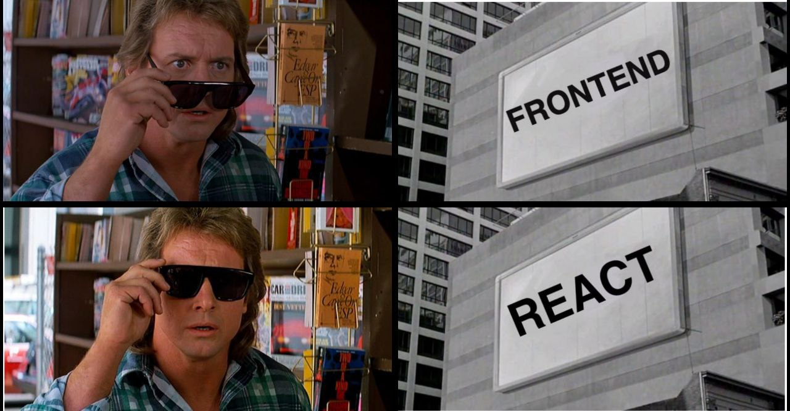

<h1> Modern Clicks </h1>
<h2>  Erlang  Fullstack Web Development with  Nitrogen  </h2>

---

Hola! I'm David Cao

 @davecaos

---

---

<h2-5> Universidad Nacional de La Matanza UNLAM </h2-5>

---

  

---

---

<h2>Why should you choose another web framework?</h2>

---

“It's easier to imagine the end of the world than the end of Javascript on the browser.”

---

---
<h2>I come to propose you a dream</h2>

---
<h2>nitrogenproject.com </h2>

---
<h2-5>Jesse Gumm and his daughter </h2-5>

---
<h2>Nitrogen Main Features</h2>

<h3 style="text-align:left;">Build HTML with Erlang terms  (as data)</h3> 
<h3 style="text-align:left;">Replace JS with Erlang functions
  (as side effects) </h3>
<h3 style="text-align:left;">You have still to use CSS
 for styling</h3> 

---
<h2-5>Nitrogen Derivated Features</h2-5>

<h3 style="text-align:left;">You don't have to switch languages between frontend and backend</h3> 
<h3 style="text-align:left;">You don't have to call a gazillion
 of Rest APIs to comunicate things with the frontend</h3>

---

---
<h2>How to be REAL Erlang developer</h2>

---

---
<h2>An Erlang atom ⚛️</h2>

---
<h2>Variables are  Capitalized! </h2>

---
<h4>You could use map/ filter/ foreach to modify a list 
But you should use List Comprehensions instead</h4>

---

<h2-5>List Comprehensions as a map </h2>

---

<h2-5>List Comprehensions as a  filter </h2>

---

<h2-5>How to bootstrap a Nitrogen project</h2-5>

---
<h2>Demo Time! </h2>

---
<h1>Gracias! </h1>